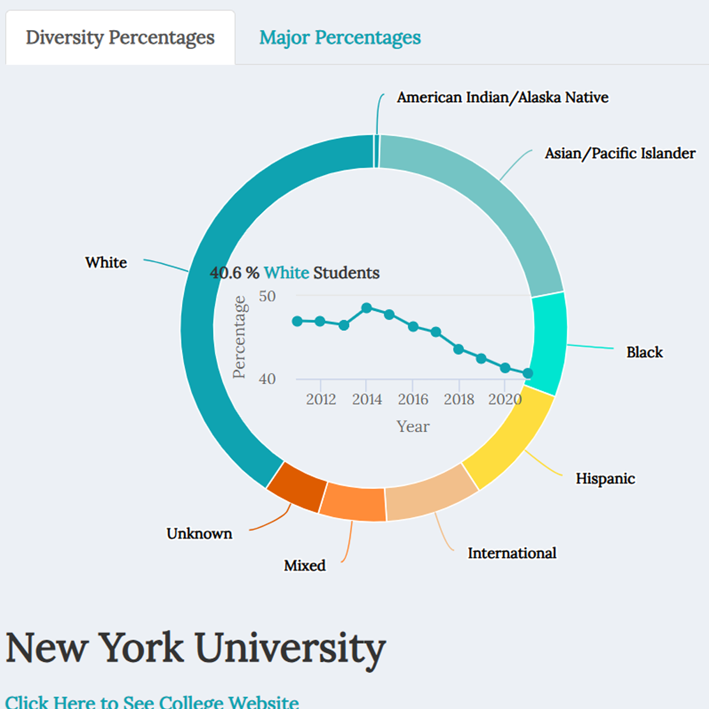
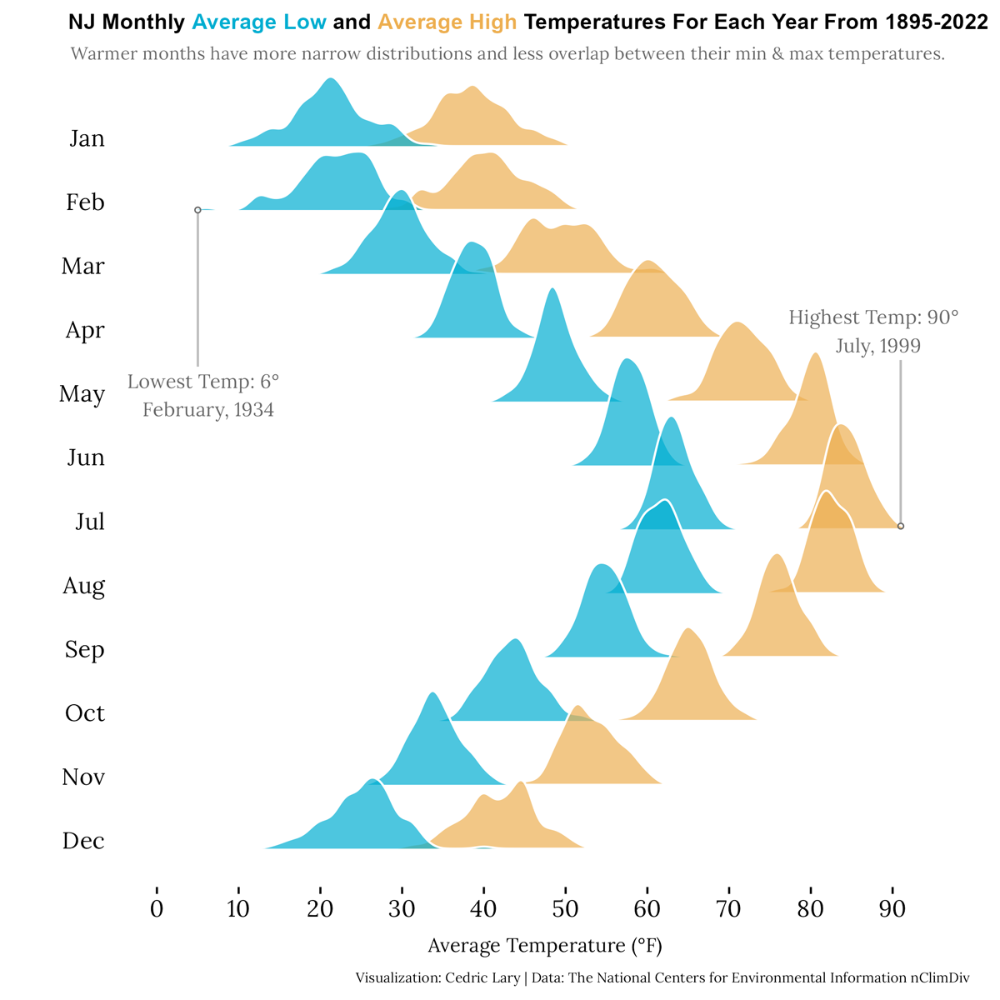
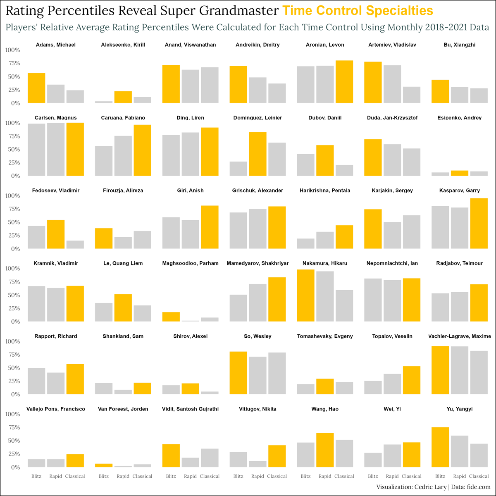
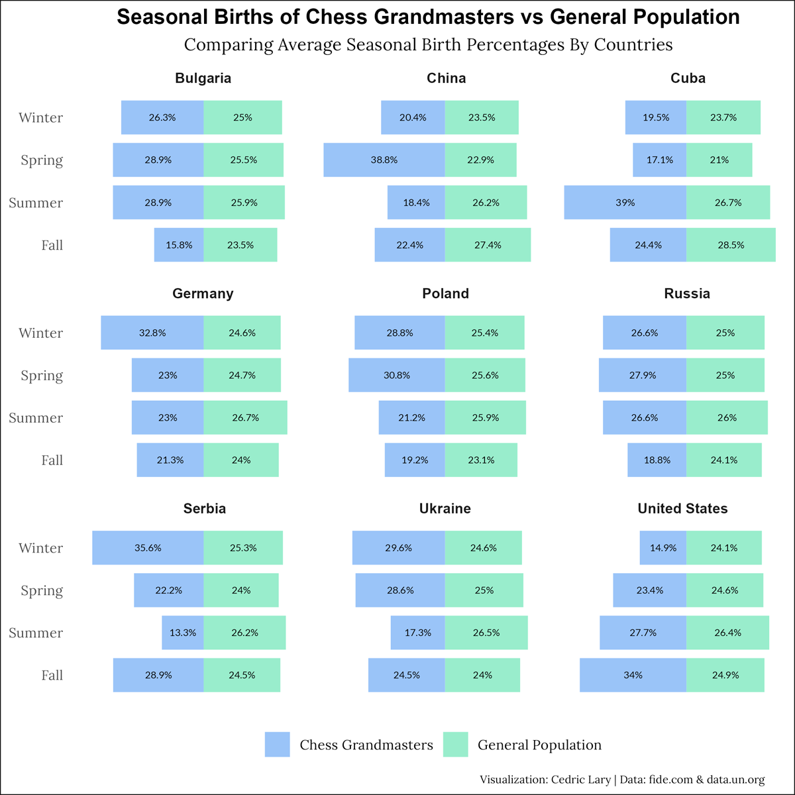
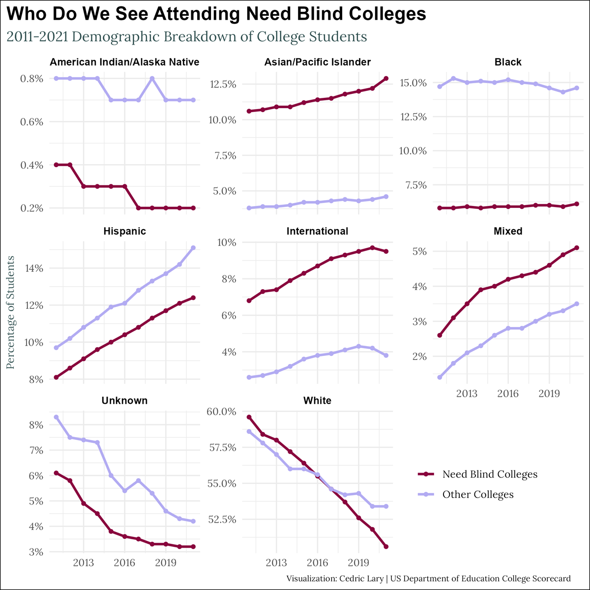
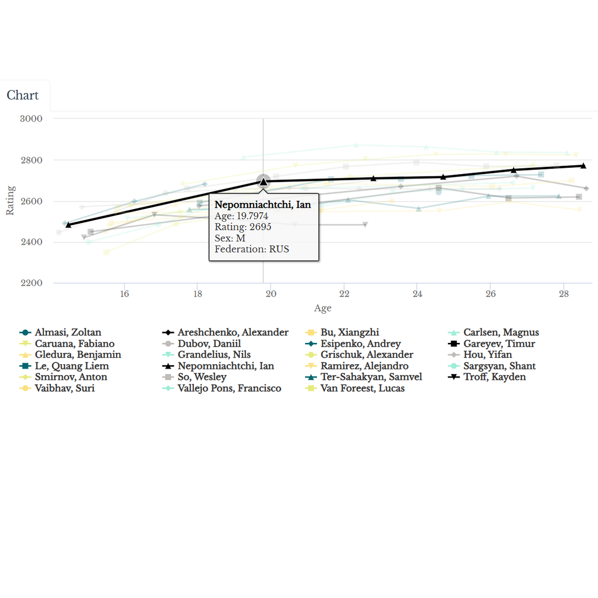
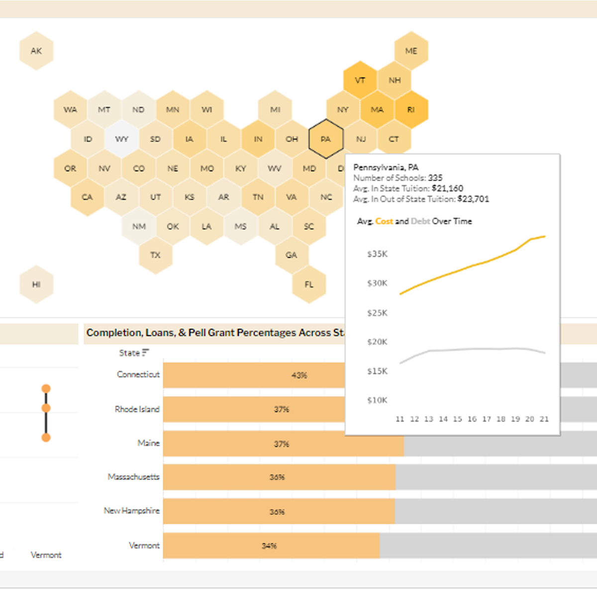
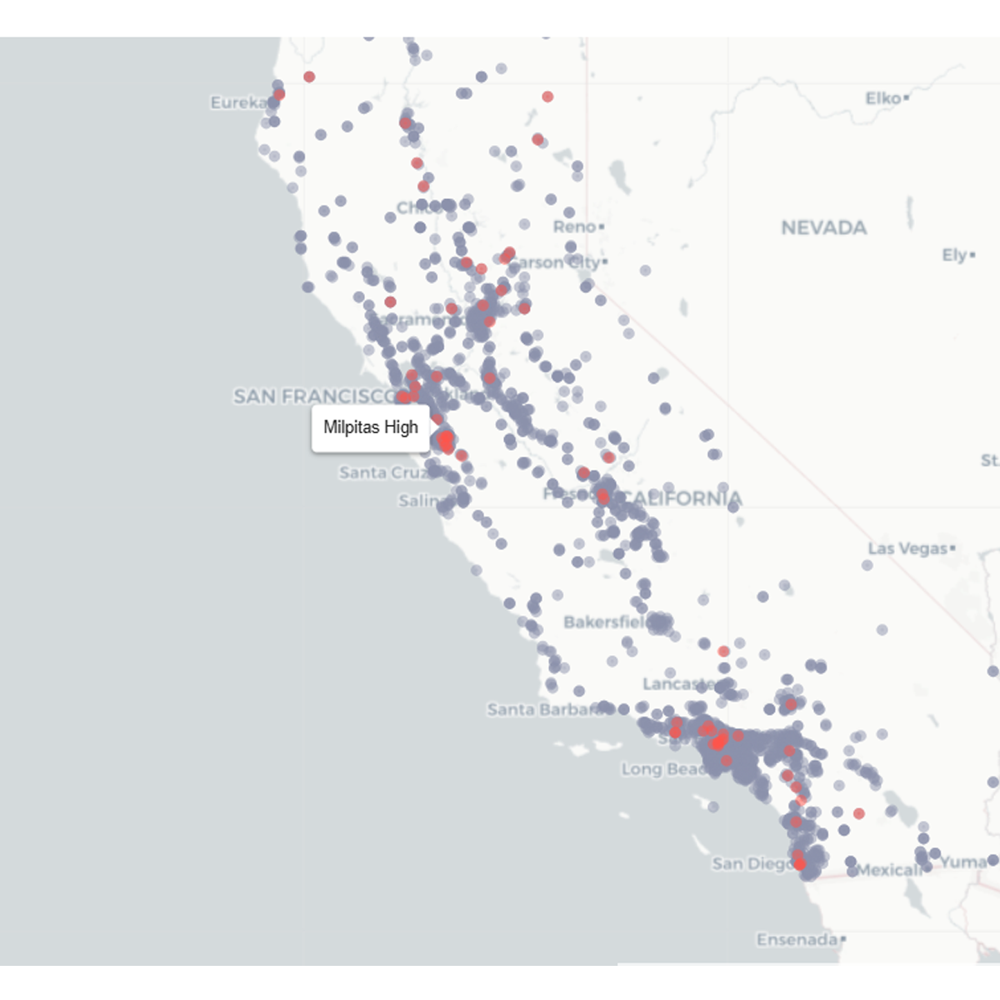
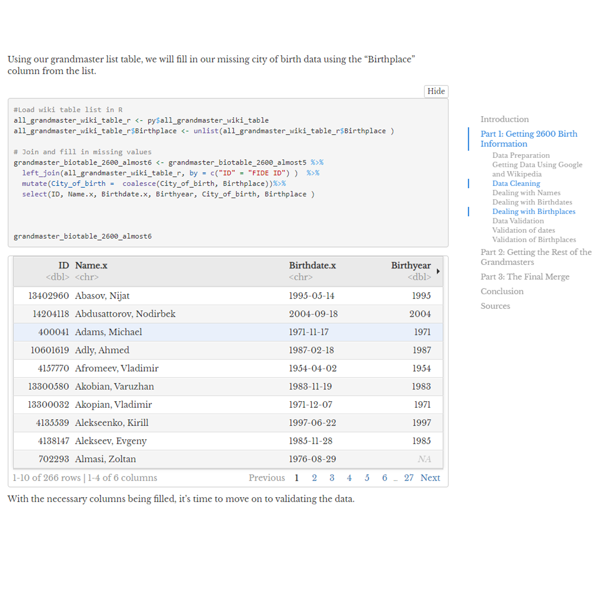

<a class= "card-link" href="https://loganlary.shinyapps.io/shiny_college_app/">

<picture></picture>

  <h4 class= "card-heading">Everything College Dashboard</h4>
  
Dashboard for comparing US colleges side by side.

  
R, Python, Shiny

</a>
<a class= "card-link" href="https://github.com/larylc/Gallery-Visualizations#what-125-years-of-temperatures-tell-us-about-weather-r">

<picture></picture>

  <h4 class= "card-heading">NJ Monthly Average Low and Average High Temperatures For Each Year</h4>
  
Graph showing NJ lows and highs from 1895-2022.

  
R, Python

</a>
<a class= "card-link" href="https://github.com/larylc/Gallery-Visualizations#percentiles-reveal-super-grandmaster-specialties-r">

<picture></picture>

  <h4 class= "card-heading">Rating Percentiles Reveal Super Grandmaster Time Control Specialties</h4>
  
Comparison of top grandmaster ratings using average percentiles.

  
R, Python

</a>
<a class= "card-link" href=https://github.com/larylc/Gallery-Visualizations#seasonal-births-of-grandmasters-vs-general-population-r">

<picture></picture>

  <h4 class= "card-heading">Seasonal Births of Chess Grandmasters vs General Population</h4>
  
Dashboard for comparing US colleges side by side.

  
R, Python

</a>
<a class= "card-link" href="https://github.com/larylc/Gallery-Visualizations#who-do-we-see-attending-need-blind-colleges-r">

<picture></picture>

  <h4 class= "card-heading">Who Do We See Attending Need Blind Colleges</h4>
  
Visualization showing trends in racial groups across need-blind and other colleges.

  
R

</a>
<a class= "card-link" href="https://loganlary.shinyapps.io/prodigy_pathway/">

<picture></picture>

  <h4 class= "card-heading">Pathway to Prodigy</h4>
  
Compare prodigies by age from 1970s-2021

  
R, Python

</a>
<a class= "card-link" href="https://public.tableau.com/app/profile/cedric.lary/viz/CollegeFinancesOverYears/CostDebtandEarnings">

<picture></picture>

  <h4 class= "card-heading">College Finances Over Years</h4>
  
Dashboard comparing cost, debt, earnings across US states.

  
R, Tableau

</a>
<a class= "card-link" href="https://larylc.github.io/lary_sql_projects/sql_project1.html">

<picture></picture>

  <h4 class= "card-heading">Investigating California High School Closures</h4>
  
Exploratory analysis examining factors that are associated with California high school closures.

  
SQL, R, Python

</a>
<a class= "card-link" href="https://larylc.github.io/chess_bdays_bplaces">

<picture></picture>

  <h4 class= "card-heading">Grandmaster B-days and B-places</h4>
  
Gathering as many chess grandmaster birthdates and birthplaces using web-scraping tools.

  
R, Python

</a>

