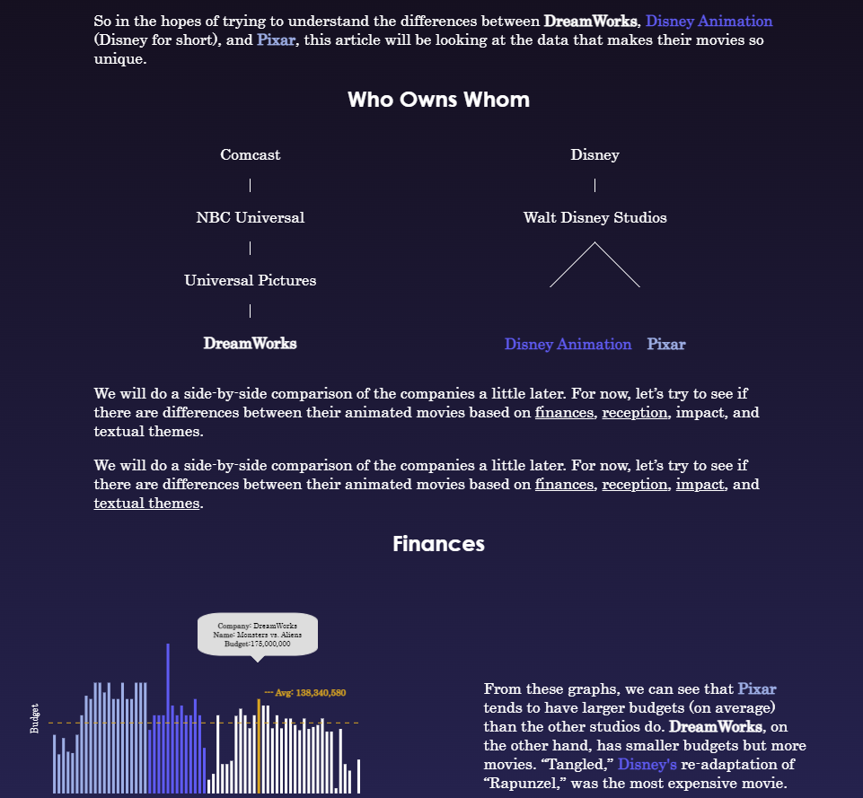

---
output:
  html_document:
    css: styles.css
---
<link id="theme-style" rel= "stylesheet" href="light.css">

 Couldn’t decide on a pallet, so you choose!

  
  
  <h2>About</h2>
  
  

  
  
Hi, I’m Cedric.

  
Welcome to my personal website! I am an aspiring data analyst. 

  
Have a look around and see what I’ve been up to. 

  
  <form action="about.html">
  <button class= "learn button">Learn More About Me </button>
  </form>
  
  
﹀

  
  

 

<h2>Projects</h2>

<a href="https://larylc.github.io/Independent-Projects-/gendered_education_project_complete.html">

  <h4 class= "card-heading">Features of One Gender Schools</h4>
  
Analysis of differences between single-sex and co-ed colleges

  
R

</a>

<a href="https://larylc.github.io/chess_bdays_bplaces/">

  <h4 class= "card-heading">Grandmaster B-days and B-places</h4>
  
Web-scraping chess player info from Wikipedia

  
R, Python

</a>

<a href="https://loganlary.shinyapps.io/prodigies_app/?_ga=2.15136438.103236738.1633010249-569369622.1613318148">

  <h4 class= "card-heading">Pathway to Prodigy</h4>
  
Shiny App for comparing chess prodigies by age

  
R, Python

</a>

<a href="https://larylc.github.io/Independent-Projects-/dreamworks_disney_pixar.html">

  <h4 class= "card-heading">DreamWork, Disney, or Pixar </h4>
  
Data viz webpage comparing animation studios

  
R, Python, D3.js

</a>

 

