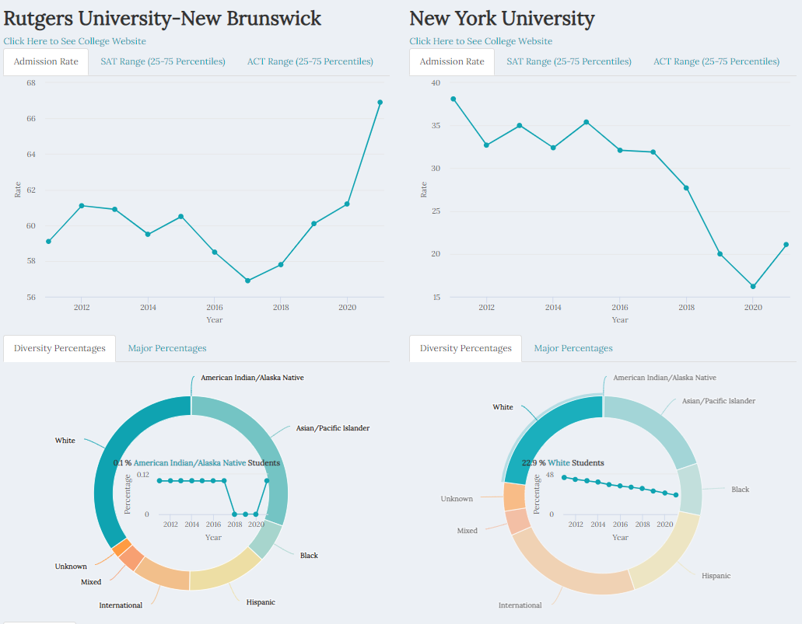
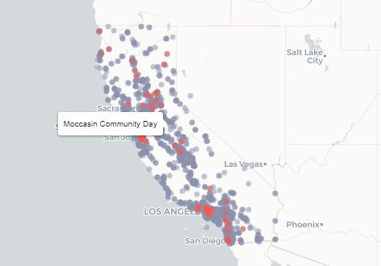

<link id="theme-style" rel= "stylesheet" href="light.css">

<section class= "container project project-section">

<svg class="svg5">
<rect class = "one" ></rect>
<rect class = "two"></rect>
<rect class = "three"></rect>
</svg>

<h2 class= "project-header">
Current Projects
 2023
</h2>

<a class= "card-link" href="https://loganlary.shinyapps.io/shiny_college_app/">

<picture></picture>

  <h4 class= "card-heading">Everything College Dashboard</h4>
  
Dashboard for comparing US colleges side by side.

  
R, Python, Shiny

</a>

<a class= "card-link" href="https://larylc.github.io/lary_sql_projects/sql_project1.html">

<picture></picture>

  <h4 class= "card-heading">Investigating California High School Closures</h4>
  
Exploratory Analysis examining factors that are associated with California high school closures.

  
SQL, R, Python

</a>

 

<h2 class= "project-header">
Archived Projects
 2020-2022
</h2>

<form class = "button-form" action="https://larylc.github.io/Independent-Projects-/index.html">
  <button class= "previous-button">previous work</button>
</form>

<h3 class= "page-design-info projects-info">Projects</h3>

<section>

